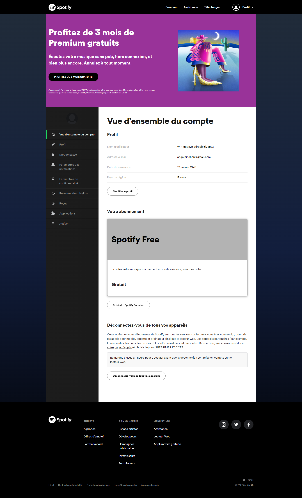

# spotify-page-html-css

Entrainement d'intégration sur la page de connexion [spotify](https://www.spotify.com/fr/).

**Langages utilisés**
- html
- css et media queries

Intégration en suivant la **Convention BEM** et la technique du **RWD**

**Visuel attendu** :

